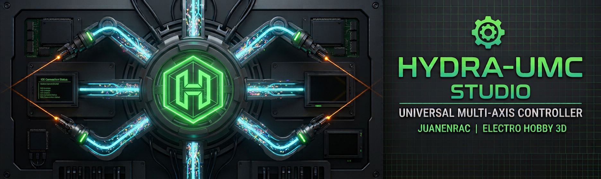

<p align="center">
  
</p>

# 🖥️ HYDRA-UMC STUDIO

### 🤖 Web-Based Control Dashboard for the HYDRA-UMC Multi-Robot Micro-Factory

---

## 🎯 Overview

**HYDRA-UMC STUDIO** is the browser-based control dashboard for [HYDRA-UMC](https://github.com/JuanenRac/HYDRA-UMC) - the multi-robot micro-factory motherboard (Raspberry Pi CM5 host + dual-core STM32H745 real-time co-processor) that orchestrates up to 8 distributed robot arms over a single FDCAN bus. Where HYDRA-UMC's own repository covers the hardware and firmware, this repository is the human-facing side: a single-page React application that visualizes every robot in real 3D, jogs and records their motion, manages the machines and accessories that go alongside a robot cell, and flashes/tests the whole CAN-OTA firmware chain - all from one browser tab, no native install required beyond Node.js.

**Honesty note, matching the rest of this ecosystem's own documentation convention:** HYDRA-UMC's own real hardware doesn't exist yet as tested silicon (its bootloaders compile clean but haven't run on real boards - see that repository's own `docs/architecture.md`). This dashboard therefore runs its CAN-OTA Flasher/Tester tools against a full built-in simulation that follows the real, documented addressing scheme for every tier, rather than pretending to talk to hardware that isn't there. The 3D robot visualization, kinematics, trajectory recording, and every accessory control panel are fully real and independent of that - only the CAN-OTA transport itself is simulated for now.

Built with **React 19**, **Vite**, **Three.js** (via `@react-three/fiber`/`@react-three/drei`), **TypeScript**, and an **Express** backend for persistent server-side state.

---

## 🦾 Multi-Robot 3D Control

Manage multiple independent 6-DOF robots simultaneously, each with its own real 3D model, kinematics, and jog/trajectory state. The model picker (RobotDetail → Config tab) groups every available robot by manufacturer:

- 🏭 **Source Robotics** - Parol6, Faze4 (MIT-licensed and GPL-3.0-licensed meshes respectively, see each model's own `ATTRIBUTION.txt`)
- 🏭 **Annin Robotics** - AR3, AR4 (MIT-licensed meshes)
- 🏭 **Universal Robots** - UR3e, UR5e, UR10e, UR16e, UR20 - official geometry, joint limits, and link kinematics pulled directly from Universal Robots' own [Universal_Robots_ROS2_Description](https://github.com/UniversalRobots/Universal_Robots_ROS2_Description) repository (BSD-3-Clause), covering the small-to-heavy payload range of their e-Series lineup
- 🏭 **UFACTORY** - xArm6, Lite 6 (BSD-3-Clause meshes, official [xarm_ros2](https://github.com/xArm-Developer/xarm_ros2) geometry/kinematics)
- 🏭 **Comau** - e.DO (BSD-3-Clause meshes, official [eDO_description](https://github.com/ianathompson/eDO_description) geometry/kinematics)
- 🏭 **Kinova** - Gen3 Lite (BSD-3-Clause meshes, official [ros2_kortex](https://github.com/Kinovarobotics/ros2_kortex) geometry/kinematics)
- 🏭 **FANUC** - M-710iC (BSD-3-Clause meshes, official [fanuc_m710ic_description](https://github.com/robot-descriptions/fanuc_m710ic_description) geometry/kinematics)
- ⚙️ **Generic** - a simplified two-link arm for any rig without a dedicated model

Every real model (everything except Generic) loads its actual STL mesh geometry per link and drives it through that manufacturer's own real joint transform chain - not a stylized placeholder. Forward/inverse kinematics are computed against each robot's own real geometry (Newton-Raphson solve for position, real per-joint limits where the robot defines any), so a recorded trajectory or a jogged Cartesian target moves the correct arm the way the physical robot actually would. Universal Robots' 5 models additionally share one common FK/IK engine (`src/examples/urKinematicsShared.ts`) and one common 3D rig renderer (`src/components/3d/URArm.tsx`), since every UR e-Series joint shares the exact same kinematic structure - only the numeric link lengths differ per model.

Per-robot jog controls include a rotary knob + slider for both **speed** and **acceleration** on every axis, and a full endstop/status readout alongside a live "Robot Controller Board" status card once CAN-OTA is wired to real hardware.

---

## 🏭 Kinematic Brain Stage

A dedicated control panel for the HYDRA-UMC motherboard's own local motion subsystem - the STM32H745's directly-driven axes, separate from the distributed robot arms on STACK A:

- 📐 **XY gantry** jog control for the X, Y1, Y2 (dual-Y gantry), and Z axes
- 🔥 **Heated bed** control (SSR-switched, 230VAC)
- 🔄 **ATC revolver** - rotary tool-index control for the E0-driven automatic tool changer
- 🎢 **Conveyor** - installed/running/speed control for the E1-driven transport belt
- 🛑 A full 12-endstop grid, 3 fan channels, and 10 pumps/10 valves for process fluidics

---

## 🎛️ Accessory & Machine Control Panels

Dedicated panels for the machines and accessories that go alongside a robot cell: **XY Table**, **ATC Tools**, **Rack Manager**, **Pick & Place** (including JuanenPnP/LumenPnP-specific configuration), **CNC** (including JuanenCNC-specific configuration), **Laser** (including JuanenLaser-specific configuration), **Vacuum Table**, and **Heated Bed**.

---

## 🔄 Works & Trajectories

Load canned example trajectories, jog-and-record your own points live, or load/save/edit/play back complex multi-point trajectories (JSON) per robot. Trajectories are portable between robot models - each recorded point is resolved through that specific robot's own real kinematics (`src/examples/robotKinematicsDispatch.ts`) at load/draw/play time, not baked against whichever robot happened to record it, so the same trajectory file drives a Parol6 and a UR10e correctly along their own real reachable geometry.

---

## 🛠️ CAN-OTA Firmware Tools

Flash and self-test firmware across the whole HYDRA-UMC + URTC CAN-OTA chain from one dashboard, with two dedicated entry points:

- **URTC → Flasher / Tester** - for the URTC Tool Head board and its own expansion boards (matches the standalone [URTC Flasher](https://github.com/JuanenRac/URTC-FLASHER)/[URTC Tester](https://github.com/JuanenRac/URTC-TESTER) desktop tools' own protocol coverage)
- **HYDRA-UMC → Flasher / Tester** - for the Robot Controller Board and Kinematic Brain tiers, relayed the whole way from CM5 → SPI → STM32H745 → FDCAN1 → Robot Controller Board → CAN → URTC Tool Head, with no JTAG/SWD probe and no USB-CAN dongle needed (see [HYDRA-UMC's own `docs/architecture.md`](https://github.com/JuanenRac/HYDRA-UMC/blob/main/docs/architecture.md) for the full addressing/relay design)

Both can download real firmware releases straight from GitHub (`firmware_manifest.json`-based, CRC32-verified) for either the `URTC` or `HYDRA-UMC` repository. As noted above, the transport itself runs against a full built-in simulation until real STM32H745 firmware exists on real hardware to talk to.

---

## 🎮 Gamepad Support

USB and Bluetooth controller integration with custom per-button/per-axis mappings, for jogging robots and accessories without a mouse/keyboard.

---

## 📹 Camera Integration

Up to 8 simultaneous live feeds (USB vision or thermal MLX90640/41/42-family sensors) with recording and inference status - the camera matrix HYDRA-UMC's own dual USB 3.0 hub subsystem is built around.

---

## 🌐 Multi-Language UI

Full interface translation across **English, Spanish, German, French, and Italian** (`src/locales/`), including the in-app Help menu.

---

## 💾 Persistent State

Server-side storage (Express backend, `server.ts`) synchronizes every configuration, path, and active machine/robot state to disk (`data/settings.json`) - state survives a page reload or a server restart. `data/settings.json` itself is deliberately excluded from the server's own static file serving (it holds controller IPs, CAN-OTA configuration, and full per-robot state), even though the rest of `data/` (e.g. `WORKS/`, saved trajectories) is served normally.

The same `GET`/`POST /api/settings` contract, plus a discovery endpoint (`GET /api/hydra-info`) and a `WebSocket /ws` for live push updates, is also how external clients connect - this is what lets [HYDRA-UMC SUITE](https://github.com/JuanenRac/HYDRA-UMC-SUITE) discover a running HYDRA-UMC STUDIO server on the network, read/modify its state, and see changes made from a browser tab reflected live (and vice versa). Full contract in [`docs/REMOTE_API.md`](docs/REMOTE_API.md).

---

## 📂 Repository Structure

```text
HYDRA-UMC-STUDIO/
├── server.ts                   # Express backend - static serving, settings persistence, Vite dev middleware, WebSocket live sync
├── docs/
│   └── REMOTE_API.md            # HTTP/WebSocket contract for remote clients (HYDRA-UMC SUITE, the mobile control apps)
├── src/
│   ├── Dashboard.tsx            # Top-level app shell - navigation, Config modal, CAN-OTA panels
│   ├── store.tsx                # Global state: RobotModel/RobotState/HydraController/SystemSettings
│   ├── components/
│   │   ├── RobotDetail.tsx      # Per-robot jog/trajectory/config panel (the model picker lives here)
│   │   ├── VirtualKinematics.tsx  # The React Three Fiber <Canvas> scene host
│   │   ├── KinematicBrainStage.tsx  # XY gantry / heated bed / ATC revolver / conveyor panel
│   │   ├── Flasher.tsx, Tester.tsx  # CAN-OTA tools (URTC and HYDRA-UMC tiers)
│   │   ├── ATCToolsConfig.tsx, RackConfigView.tsx, PickAndPlace.tsx, CNC.tsx, Laser.tsx,
│   │   │   VacuumTableConfig.tsx, HeatedBedConfig.tsx, XYTableConfig.tsx
│   │   │                       # Accessory/machine control panels
│   │   ├── JuanenPnPConfig.tsx, LumenPnPConfig.tsx, JuanenCNCConfig.tsx, JuanenLaserConfig.tsx
│   │   │                       # Machine-specific configuration variants
│   │   ├── CamerasView.tsx, GamepadConfig.tsx, GamepadController.tsx, HelpModal.tsx
│   │   └── 3d/
│   │       ├── RobotArm.tsx     # Dispatches to the correct per-model rig by robot.model
│   │       ├── Parol6Arm.tsx, Faze4Arm.tsx, AR3Arm.tsx, AR4Arm.tsx, GenericRobotArm.tsx
│   │       │                   # Manufacturer-specific rigs (each hand-transcribed from its own URDF)
│   │       ├── URArm.tsx        # Shared parametrized rig for every Universal Robots model
│   │       ├── UR3eArm.tsx, UR5eArm.tsx, UR10eArm.tsx, UR16eArm.tsx, UR20Arm.tsx
│   │       │                   # Thin per-model wrappers around URArm.tsx
│   │       ├── Shared3DEnvironment.tsx, SharedModule3DView.tsx, PathVisualizer.tsx,
│   │       │   Toolhead.tsx, DraggableGizmo.tsx, ATC3DView.tsx, Rack3DView.tsx
│   │       │                   # Scene environment, trajectory drawing, tool/gizmo rendering
│   ├── examples/
│   │   ├── kinematics.ts, utils.ts, robotKinematicsDispatch.ts
│   │   │                       # Shared generic 2-link kinematics + per-model dispatch
│   │   ├── parol6Kinematics.ts, faze4Kinematics.ts, ar3Kinematics.ts, ar4Kinematics.ts
│   │   │                       # Manufacturer-specific real FK/IK
│   │   ├── urKinematicsShared.ts  # Shared FK/IK engine for every Universal Robots model
│   │   ├── ur3eKinematics.ts, ur5eKinematics.ts, ur10eKinematics.ts, ur16eKinematics.ts, ur20Kinematics.ts
│   │   │                       # Thin per-model UR chain/limits/home-pose data
│   │   └── list/                # Canned example trajectories
│   ├── lib/canOta.ts            # CAN-OTA simulation/protocol layer, GitHub firmware download
│   └── locales/                 # en/es/de/fr/it translation files
├── public/models/                # Real 3D mesh assets, one folder per robot
│   ├── parol6/, faze4/, ar3/, ar4/  # Each with its own ATTRIBUTION.txt (MIT or GPL-3.0)
│   └── ur3e/, ur5e/, ur10e/, ur16e/, ur20/, xarm6/, lite6/, edo/, gen3lite/, m710ic/  # Each with its own ATTRIBUTION.txt (BSD-3-Clause)
├── images/                       # README banner
└── data/                         # Server-persisted state (settings.json, WORKS/) - created at runtime
```

---

## 🛠️ Development Environment

### Requirements
- [Node.js](https://nodejs.org/) (v18 or higher recommended)
- npm

### Installation

```bash
npm install
```

### Development Mode

Runs the app with live-reloading (Vite dev middleware inside the same Express server, `server.ts`):
- **Windows:** double-click `dev.bat` or run `npm run dev`
- **Linux/Mac:** run `./dev.sh` or `npm run dev`

### Production Build

Compiles into an optimized, single-file server deployment:
- **Windows:** double-click `build.bat` or run `npm run build`
- **Linux/Mac:** run `./build.sh` or `npm run build`

Then start the production server with:
```bash
npm start
```

The server runs on `http://localhost:3000` (or `http://<your-local-ip>:3000` across your local network). All state and data persist in the `data/` directory.

---

## 🔗 Related Projects

This project is part of a larger robotics ecosystem by the same author (JuanenRac / Electro Hobby 3D). Worth knowing about, since a request might actually be about one of these rather than this repository:

**HYDRA-UMC platform** — the multi-robot micro-factory cell
- **[HYDRA-UMC](https://github.com/JuanenRac/HYDRA-UMC)** — the motherboard itself: Raspberry Pi CM5 host + dual-core STM32H745 real-time co-processor, orchestrating up to 8 distributed robot arms over CAN-OTA/SPI-OTA. Own hardware + firmware, GPL-3.0/CERN-OHL-S v2/CC BY-SA 4.0.
- **HYDRA-UMC STUDIO** *(this repository)* — web-based control dashboard for HYDRA-UMC: multi-robot 3D visualization, kinematics/trajectory recording, CAN-OTA flashing and testing for the whole platform. React + Vite + Three.js.
- **[HYDRA-UMC-ANDROID-CONTROL](https://github.com/JuanenRac/HYDRA-UMC-ANDROID-CONTROL)** — Android control app for HYDRA-UMC over Wi-Fi/Bluetooth. Scaffolding stage (architecture doc + VSCode/Gradle project layout), real implementation pending.
- **[HYDRA-UMC-IOS-CONTROL](https://github.com/JuanenRac/HYDRA-UMC-IOS-CONTROL)** — iOS control app for HYDRA-UMC over Wi-Fi/Bluetooth. Scaffolding stage (architecture doc + VSCode/Swift Package layout), real implementation pending.
- **[HYDRA-UMC-SUITE](https://github.com/JuanenRac/HYDRA-UMC-SUITE)** — desktop (Python/PySide6) swarm command center: multi-controller network discovery, live bidirectional sync, real 3D robot viewport, Photoshop-style dockable workspace. Real and working, not a placeholder.

**URTC platform** — the tool head controller every HYDRA-UMC robot arm carries
- **[URTC](https://github.com/JuanenRac/URTC)** — Universal Robot Tool Controller: STM32F303-based CAN bus tool head controller, 25 fully-implemented tool profiles, CAN-OTA firmware update.
- **[URTC Flasher](https://github.com/JuanenRac/URTC-FLASHER)** — desktop CAN-OTA + full-chip SWD/JTAG flashing tool for URTC boards (Windows/Linux).
- **[URTC Tester](https://github.com/JuanenRac/URTC-TESTER)** — desktop live CAN-bus diagnostic tool for URTC boards, one panel per tool profile (Windows/Linux).
- **[URTC Web Studio](https://github.com/JuanenRac/URTC-WEB-STUDIO)** — browser-based alternative to the 2 desktop tools above (Web Serial API + SLCAN), no local install needed.

---

## 👤 Author

**JuanenRac** (Electro Hobby 3D)
📧 electrohobby3d@gmail.com
📺 youtube.com/@electrohobby3d

---

## 📜 License and Copyright Notices

HYDRA-UMC STUDIO is (c) 2026 JuanenRac (Electro Hobby 3D). This notice must be included in any distributions of this project or derivative works.

The source code of this application is available under the **GNU General Public License v3.0 (GPL-3.0)**. Full text at https://www.gnu.org/licenses/gpl-3.0.html.

**Third-party robot mesh assets:** the real 3D geometry under `public/models/` is NOT covered by the GPL-3.0 above - each robot model's own mesh files are separately-licensed, third-party assets, redistributed here under their own original terms:

| Manufacturer | Models | License |
|---|---|---|
| Source Robotics | Parol6 | GPL-3.0 |
| Source Robotics | Faze4 | MIT |
| Annin Robotics | AR3, AR4 | MIT |
| Universal Robots | UR3e, UR5e, UR10e, UR16e, UR20 | BSD-3-Clause |
| UFACTORY | xArm6, Lite 6 | BSD-3-Clause |
| Comau | e.DO | BSD-3-Clause |
| Kinova | Gen3 Lite | BSD-3-Clause |
| FANUC | M-710iC | BSD-3-Clause |

Each model's own exact source repository, path, and license text reference lives in that model's own `public/models/<slug>/ATTRIBUTION.txt` - consult that file before redistributing a specific mesh set, rather than assuming the table above is a substitute for it.

This dashboard is the web control panel for the [HYDRA-UMC](https://github.com/JuanenRac/HYDRA-UMC) motherboard project - see that repository for its own hardware (CERN-OHL-S v2) and firmware (GPL-3.0) licensing, which this repository's own license doesn't extend to, and vice versa. It also implements CAN-OTA tooling against the [URTC](https://github.com/JuanenRac/URTC) protocol - see that project's own repository for its own separate license.

If you build on this project, keep the licensing split in mind: code changes should stay GPL-3.0, and any redistribution of a specific robot's mesh assets should stay under that model's own original license - each with attribution back to this project and its author.
