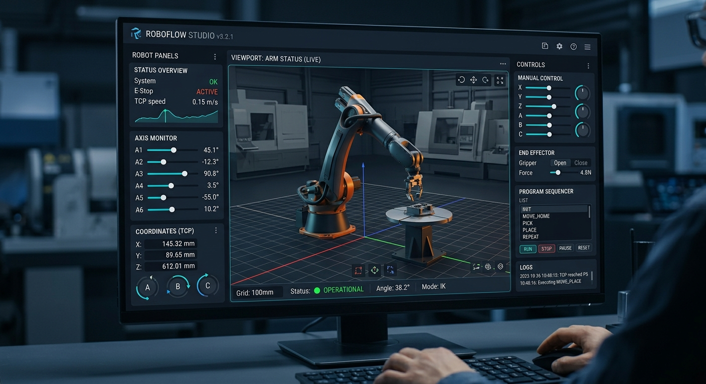
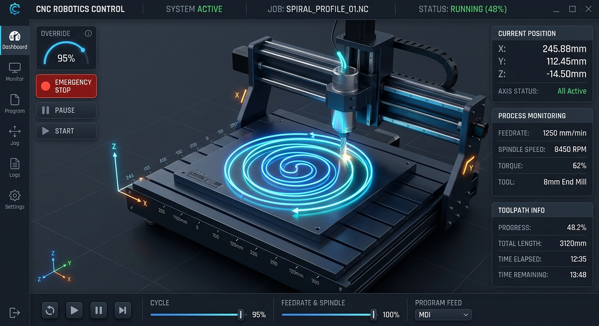
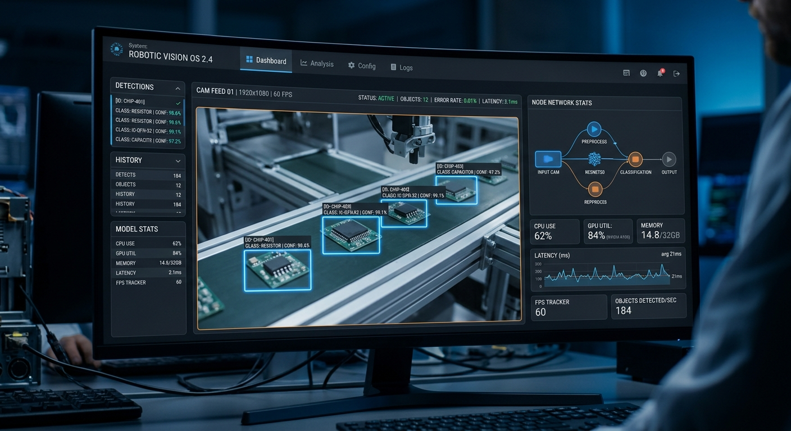

# 🚀 Hydra-UMC Studio Robotic Arm Control Interface



Hydra-UMC Studio is a web-based, full-featured control panel designed to monitor and manage up to 8 robotic arms (Parol6, Faze4, Generic) concurrently. It supports assigning tools (e.g. CNC Spindles, Lasers, 3D Print Extruders), moving joints manually, configuring global XY tables, managing Automatic Tool Changers (ATC), monitoring camera feeds, and recording robotic trajectories.

## 🛠️ Features

- **Multi-Controller Architecture (Ethernet/IP):** Connect to multiple HYDRA-UMC boards simultaneously via IP. Each controller can manage its own isolated FDCAN network.
- **Multi-Robot Dashboard:** Overview of up to 8 robotic arms per controller with online/offline status, current roles, tools, and ATC configurations. Fully responsive 1920x1080 layout.
- **Virtual Kinematics:** 3D rendering of the robotic arm movements in real-time, showing visual representations of 26 different attachable tools. Includes an interactive Gizmo to Translate, Rotate, and Scale (0.10x to 2.0x) any 3D object dynamically in the workspace.



- **Smooth Interpolated Playback (NEW!):** Precision kinematics path execution with dynamic velocity calculation. Time durations for trajectory segments automatically calculate based on actual Cartesian (XY) and Joint distance, producing jitter-free, constant-velocity motion. 
- **Modular 3D Architecture:** 3D objects and components (Robot Arms, Toolheads, ATC, Racks, and Gizmos) have been separated into individual files in `src/components/3d/` for independent editing and scalability. Specific arm designs for Parol6, Faze4, AR3, and AR4 are now supported and can be visually customized independently.
- **Shared Resources & Modular Navigation:** Dedicated vertical sub-menu navigation for an expanding list of hardware modules. Modular configuration panels for shared hardware, including JuanenPnP, LumenPnP, JuanenCNC, JuanenLaser, Vacuum Tables (with pump/valve control), and Heated Beds (with SSR and dual thermistor readouts).
- **Advanced Jogging (Joint & Cartesian):** Granular jogging of individual joints with step sizes from 0.01° to 45.00°. Includes Pseudo-Inverse Kinematics for smooth Cartesian (XYZ ABC) jogging.
- **XY Table Configuration:** Fully interactive 3D setup for global XY stages, assignable to specific robots for advanced positioning and interpolation.
- **Automatic Tool Changer (ATC):** Configure Vertical Panel, Horizontal Panel, or Revolver ATC types. Assign tools to slots and define pickup coordinates (XYZABC + XY Table).
- **Input/Output Rack System:** Configure custom PCB/Pallet racks for Pick & Place scenarios, complete with capacity, usable slots, and pickup calibration.



- **Vision Matrix (Cameras):** Multi-camera view matrix with full-screen toggling, Picture-in-Picture (PiP) live view (now also integrated directly in the Robot Detail view), and YOLOv8 Object Detection overlay support.
- **Trajectory Management:** Record waypoints manually, or load from over 25+ preset kinematic examples (Spirals, Raster Scans, XY Sync patterns). Export and import trajectories as JSON. Variable speed playback.
- **System Configuration:** Manage network settings (CAN Bus Bitrate, Master IP), 16+ custom themes (Cyberpunk, Matrix, Dracula, etc.), and execute emergency protocols (Global E-Stop, Controller Reboot).
- **I/O Control:** Monitor and actuate valves, pumps, and endstops directly from the robot detail view.
- **Auto-Documented Source Code:** The entire codebase includes extensive JSDoc descriptions and copyright headers for readability and simple maintainability.

## 🚀 Installation & Setup

Ensure you have [Node.js](https://nodejs.org/) (version 18+) installed.

1. **Clone the repository:**
   ```bash
   git clone https://github.com/JuanenRac/hydra-umc-studio.git
   cd hydra-umc-studio
   ```

2. **Install dependencies:**
   ```bash
   npm install
   ```

3. **Run the development server:**
   ```bash
   npm run dev
   ```
   *The application will be accessible at `http://localhost:3000` (or the port specified in your console).*

4. **Build for production:**
   ```bash
   npm run build
   ```

## 💻 Tech Stack

- React 18+ (Vite)
- Tailwind CSS (Styling)
- Three.js / @react-three/fiber / @react-three/drei (3D Kinematics & Visualization)
- Lucide React (Icons)
- TypeScript

## 📜 License and Copyright Notices

This project is licensed under the GNU General Public License v3.0 (GPL-3.0). See the `LICENSE` file for more details.

## 👤 Author

**JuanenRac** (Electro Hobby 3D)  
📧 electrohobby3d@gmail.com  
📺 [youtube.com/@electrohobby3d](https://youtube.com/@electrohobby3d)
