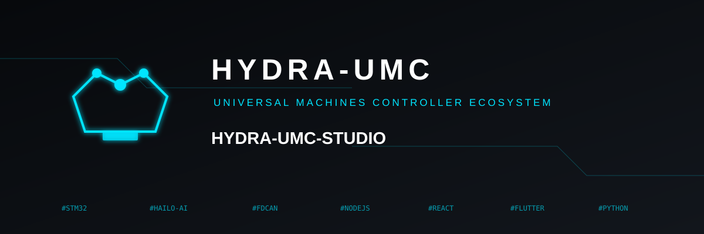

<p align="center">
  
</p>

# 🖥️ HYDRA-UMC STUDIO

<p align="center">
  <a href="README.md">🇺🇸 English</a> |
  🇪🇸 <b>Español</b> |
  <a href="README_fra.md">🇫🇷 Français</a> |
  <a href="README_ita.md">🇮🇹 Italiano</a> |
  <a href="README_deu.md">🇩🇪 Deutsch</a> |
  <a href="README_zho.md">🇨🇳 简体中文</a> |
  <a href="README_jpn.md">🇯🇵 日本語</a>
</p>


### 🤖 Panel de Control Web para la Micro-Fábrica Multi-Robot HYDRA-UMC

<p align="left">
  
  
  
  
</p>


---

## 🎯 Visión General

**HYDRA-UMC STUDIO** es el panel de control basado en navegador para [HYDRA-UMC](https://github.com/JuanenRac/HYDRA-UMC) - la placa madre de la micro-fábrica multi-robot (host Raspberry Pi CM5 + coprocesador de tiempo real STM32H745 de doble núcleo) que orquesta hasta 8 brazos robóticos distribuidos sobre un único bus FDCAN. Mientras que el propio repositorio de HYDRA-UMC cubre el hardware y el firmware, este repositorio es la parte orientada al humano: una aplicación React de una sola página que visualiza cada robot en 3D real, jogea y graba su movimiento, gestiona las máquinas y accesorios que acompañan a una célula robótica, y flashea/prueba toda la cadena de firmware CAN-OTA - todo desde una sola pestaña del navegador, sin necesidad de instalación nativa más allá de Node.js.

**Nota de honestidad, siguiendo la misma convención de documentación que el resto de este ecosistema:** el propio hardware real de HYDRA-UMC todavía no existe como silicio probado (sus bootloaders compilan limpio pero no se han ejecutado en placas reales - ver el propio `docs/architecture.md` de ese repositorio). Por eso este panel ejecuta sus herramientas de Flasher/Tester CAN-OTA contra una simulación completa incorporada que sigue el esquema de direccionamiento real y documentado de cada nivel, en vez de fingir hablar con un hardware que no existe. La visualización 3D de los robots, la cinemática, la grabación de trayectorias, y cada panel de control de accesorios son completamente reales e independientes de eso - solo el transporte CAN-OTA en sí está simulado por ahora.

Construido con **React 19**, **Vite**, **Three.js** (vía `@react-three/fiber`/`@react-three/drei`), y **TypeScript** - un cliente puro sin código de backend propio. El estado persistente vive en el backend separado **[HYDRA-UMC SERVER](https://github.com/JuanenRac/HYDRA-UMC-SERVER)** con el que esta app habla por red.

---

## 🦾 Control 3D Multi-Robot

Gestiona varios robots independientes de 6 grados de libertad (6-DOF) simultáneamente, cada uno con su propio modelo 3D real, cinemática, y estado de jog/trayectoria. El selector de modelo (RobotDetail → pestaña Config) agrupa cada robot disponible por fabricante:

- 🏭 **Source Robotics** - Parol6, Faze4 (mallas licenciadas bajo MIT y GPL-3.0 respectivamente, ver el propio `ATTRIBUTION.txt` de cada modelo)
- 🏭 **Annin Robotics** - AR3, AR4 (mallas licenciadas bajo MIT)
- 🏭 **Universal Robots** - UR3e, UR5e, UR10e, UR16e, UR20 - geometría oficial, límites de articulación, y cinemática de eslabones extraídos directamente del propio repositorio [Universal_Robots_ROS2_Description](https://github.com/UniversalRobots/Universal_Robots_ROS2_Description) de Universal Robots (BSD-3-Clause), cubriendo el rango de carga útil de pequeña a pesada de su gama e-Series
- 🏭 **Universal Robots (clásica)** - UR3, UR5, UR10 - la gama CB anterior a la e-Series, geometría/parámetros DH oficiales del propio repositorio [universal_robot](https://github.com/ros-industrial/universal_robot) de ROS-Industrial (BSD-3-Clause)
- 🏭 **UFACTORY** - xArm6, Lite 6 (mallas BSD-3-Clause, geometría/cinemática oficial de [xarm_ros2](https://github.com/xArm-Developer/xarm_ros2))
- 🏭 **Comau** - e.DO (mallas BSD-3-Clause, geometría/cinemática oficial de [eDO_description](https://github.com/ianathompson/eDO_description))
- 🏭 **Kinova** - Gen3 Lite, Gen2 (mallas BSD-3-Clause, geometría/cinemática oficial de [ros2_kortex](https://github.com/Kinovarobotics/ros2_kortex))
- 🏭 **FANUC** - M-710iC (mallas BSD-3-Clause, geometría/cinemática oficial de [fanuc_m710ic_description](https://github.com/robot-descriptions/fanuc_m710ic_description))
- 🏭 **The Robot Studio** - SO-ARM100, un brazo de bajo coste de 5-DOF (no 6) (mallas Apache-2.0, geometría/cinemática oficial de [SO-ARM100](https://github.com/TheRobotStudio/SO-ARM100))
- 🏭 **AgileX** - PiPER (mallas Apache-2.0, geometría/cinemática oficial de [agilex_piper_arm_description](https://github.com/renesas-rdk/agilex_piper_arm_description))
- 🏭 **Unitree** - Z1 (mallas BSD-3-Clause, vía [mujoco_menagerie](https://github.com/google-deepmind/mujoco_menagerie) de Google DeepMind - cada carpeta de robot ahí mantiene su propia licencia original del fabricante)
- 🏭 **Trossen Robotics** - ViperX 300, WidowX 250 (mallas BSD-3-Clause, geometría/cinemática oficial de [interbotix_ros_manipulators](https://github.com/Interbotix/interbotix_ros_manipulators))
- 🏭 **Koch / Low-Cost Robot Arm** - Koch v1.1, otro brazo de bajo coste de 5-DOF (no 6) (mallas Apache-2.0, vía [mujoco_menagerie](https://github.com/google-deepmind/mujoco_menagerie))
- ⚙️ **Genérico** - un brazo simplificado de dos eslabones para cualquier configuración sin un modelo dedicado

Son 24 modelos de robot reales repartidos en 13 fabricantes, más el placeholder Genérico - ver la tabla de licencias más abajo para el mapeo exacto modelo↔fabricante↔licencia que resume esta lista. Cada modelo real (todos excepto el Genérico) carga la geometría de malla STL real por eslabón y la mueve a través de la cadena real de transformación de articulaciones propia de ese fabricante - no un placeholder estilizado. La cinemática directa/inversa se calcula contra la geometría real propia de cada robot (resolución Newton-Raphson para la posición, límites reales por articulación donde el robot los define), de modo que una trayectoria grabada o un objetivo cartesiano jogeado mueve el brazo correcto tal como lo haría el robot físico real. Los 5 modelos e-Series de Universal Robots comparten además un único motor FK/IK común (`src/examples/urKinematicsShared.ts`) y un único renderizador de rig 3D común (`src/components/3d/URArm.tsx`), ya que cada articulación de la e-Series de UR comparte exactamente la misma estructura cinemática - solo difieren por modelo las longitudes numéricas de los eslabones. Los 3 modelos clásicos de UR (UR3/UR5/UR10) comparten en cambio su propio motor y renderizador separados (`src/examples/urClassicKinematics.ts`, `src/components/3d/UrClassicArm.tsx`), ya que esa generación anterior no comparte un mismo eje Z local en todas sus articulaciones como sí lo hace la e-Series.

Los controles de jog por robot incluyen una perilla giratoria + deslizador tanto para **velocidad** como para **aceleración** en cada eje, y una lectura completa de endstop/estado junto a una tarjeta de estado "Robot Controller Board" en vivo una vez que CAN-OTA está conectado a hardware real. Cada perilla/deslizador se ajusta al valor de **Step** de jog seleccionado en su propio combobox (de 0.1° hasta 100°/mm) en vez de moverse de forma continua. El robot **A1** es una prueba de concepto en marcha para una disposición distinta: sus controles de jog Speed/Acceleration/J1-J6/XYZ viven en un panel flotante arrastrable sobre el propio visor 3D (`Joystick3D.tsx` para el pad XYZ) en vez del panel debajo que todos los demás robots siguen usando - ver `src/components/robots/A1.tsx`.

---

## 🏭 Etapa Kinematic Brain

Un panel de control dedicado al propio subsistema de movimiento local de la placa madre HYDRA-UMC - los ejes accionados directamente por el STM32H745, separados de los brazos robóticos distribuidos en STACK A:

- 📐 Control de jog del **pórtico XY** para los ejes X, Y1, Y2 (pórtico Y dual), y Z
- 🔥 Control de **cama caliente** (conmutada por SSR, 230VAC)
- 🔄 **Revolver ATC** - control de índice de herramienta rotativo para el cambiador automático de herramientas accionado por E0
- 🎢 **Transportador** - control de instalado/en marcha/velocidad para la cinta de transporte accionada por E1
- 🛑 Una rejilla completa de 12 endstops, 3 canales de ventilador, y 10 bombas/10 válvulas para la fluídica del proceso

---

## 🎛️ Paneles de Control de Accesorios y Máquinas

Paneles dedicados para las máquinas y accesorios que acompañan a una célula robótica: **Mesa XY**, **Herramientas ATC**, **Gestor de Racks**, **Pick & Place** (incluyendo configuración específica de JuanenPnP/LumenPnP), **CNC** (incluyendo configuración específica de JuanenCNC), **Láser** (incluyendo configuración específica de JuanenLaser), **Mesa de Vacío**, y **Cama Caliente**.

---

## 🔄 Trabajos y Trayectorias

Carga trayectorias de ejemplo predefinidas, jogea y graba tus propios puntos en vivo, o carga/guarda/edita/reproduce trayectorias complejas multi-punto (JSON) por robot. Las trayectorias son portables entre modelos de robot - cada punto grabado se resuelve a través de la cinemática real propia de ese robot específico (`src/examples/robotKinematicsDispatch.ts`) en el momento de cargar/dibujar/reproducir, no se calcula de forma fija contra el robot con el que se grabó, de modo que el mismo archivo de trayectoria mueve correctamente a un Parol6 y a un UR10e a lo largo de su propia geometría alcanzable real.

---

## 🛠️ Herramientas de Firmware CAN-OTA

Flashea y auto-prueba el firmware a través de toda la cadena CAN-OTA de HYDRA-UMC + URTC desde un solo panel, con dos puntos de entrada dedicados:

- **URTC → Flasher / Tester** - para la placa URTC Tool Head y sus propias placas de expansión (coincide con la cobertura de protocolo propia de las herramientas de escritorio independientes [URTC Flasher](https://github.com/JuanenRac/URTC-FLASHER)/[URTC Tester](https://github.com/JuanenRac/URTC-TESTER))
- **HYDRA-UMC → Flasher / Tester** - para los niveles Robot Controller Board y Kinematic Brain, relevado todo el camino desde CM5 → SPI → STM32H745 → FDCAN1 → Robot Controller Board → CAN → URTC Tool Head, sin necesitar sonda JTAG/SWD ni adaptador USB-CAN (ver el propio [`docs/architecture.md` de HYDRA-UMC](https://github.com/JuanenRac/HYDRA-UMC/blob/main/docs/architecture.md) para el diseño completo de direccionamiento/relevo)

Ambos pueden descargar releases de firmware reales directamente desde GitHub (basado en `firmware_manifest.json`, verificado por CRC32) tanto para el repositorio `URTC` como para `HYDRA-UMC`. Como se indica arriba, el propio transporte se ejecuta contra una simulación completa incorporada hasta que exista firmware STM32H745 real en hardware real con el que hablar.

---

## 🎮 Soporte de Mando

Integración de mandos USB y Bluetooth con mapeos personalizados por botón/por eje, para jogear robots y accesorios sin ratón/teclado.

---

## 📹 Integración de Cámaras

Hasta 8 feeds en vivo simultáneos (visión USB o sensores térmicos de la familia MLX90640/41/42) con grabación y estado de inferencia - la matriz de cámaras alrededor de la cual está construido el propio subsistema de hub USB 3.0 dual de HYDRA-UMC.

---

## 🌐 Interfaz Multi-Idioma

Traducción completa de la interfaz en **inglés, español, alemán, francés e italiano** (`src/locales/`), incluyendo el menú de Ayuda dentro de la app, el diálogo Acerca de (versión/autor/licencia), y cada pestaña del diálogo de Configuración del Sistema. La cobertura todavía no es del 100% de cada pantalla - un puñado de paneles de accesorios independientes sigue codificado en inglés, sin alcanzar todavía por el trabajo de traducción.

---

## ℹ️ Acerca de y Configuración del Sistema

Dos diálogos independientes, ambos accesibles desde la cabecera (botones `Config`/`About`): **About** muestra la versión de la app en ejecución (leída en vivo desde `GET /api/hydra-info`), el autor, y la licencia; **Config** cubre la identidad del servidor, gestión de controladores/nodos, tema de UI + idioma, renombrado de robots, mapeo cámara↔robot con detección de conflictos, la biblioteca de URDF personalizados, integraciones de software de terceros (backends de OpenPnP/CNC/Láser), acceso remoto por cliente (interruptores independientes para SUITE/Android/iOS), cuentas de usuario, directorios de trabajo por robot, transporte CAN-OTA, y mapeo de mando - cada uno en su propia pestaña. Ambos son sus propios componentes (`src/components/About.tsx`, `src/components/Config.tsx`), no están integrados en línea dentro del shell principal del dashboard.

## 🔐 Cuentas y Acceso

Cada servidor siembra una cuenta en su propio primer arranque - usuario `admin`, contraseña `admin` - cámbiala desde **Config > Users** tan pronto como el servidor sea alcanzable más allá de una LAN totalmente de confianza. Esa misma pestaña permite a una cuenta admin crear cuentas adicionales de **operador**: un operador puede iniciar sesión, observar el estado en vivo, y manejar robots (jog/reproducir/pausar/detener/herramienta/válvula/bomba/velocidad), pero no puede sobrescribir los ajustes globales ni gestionar otras cuentas. No se requiere ninguna cuenta solo para mirar - el propio "Continuar en solo lectura" de la pantalla de inicio de sesión salta directamente al dashboard con las escrituras deshabilitadas. Contrato completo (roles, tokens, las rutas `/api/users`) documentado en el propio [`docs/REMOTE_API.md` de HYDRA-UMC-SERVER](https://github.com/JuanenRac/HYDRA-UMC-SERVER/blob/main/docs/REMOTE_API.md), secciones 2a/2b.

Cada uno de los 3 clientes remotos (SUITE, Android, iOS) se auto-identifica mediante una cabecera de petición `X-Hydra-Client`, de modo que **Config > Remote Access** puede permitir o bloquear cada uno de forma independiente en vez de un único interruptor combinado para los tres.

---

## 💾 Estado Persistente

HYDRA-UMC STUDIO en sí es un cliente puro - no mantiene ningún estado propio más allá de lo que está en memoria para la sesión actual. Toda la persistencia (`settings.json`, `users.json`, trayectorias guardadas bajo `WORKS/`, modelos enviados) vive en el backend separado **[HYDRA-UMC SERVER](https://github.com/JuanenRac/HYDRA-UMC-SERVER)** con el que esta app habla por red (ver el propio `data/` y README de ese proyecto para el panorama completo) - el estado sobrevive a una recarga de página o a un redespliegue de esta app, ya que ninguno de los dos toca el proceso del backend en absoluto. `settings.json` en sí está deliberadamente excluido del servicio de archivos estáticos de ese backend (contiene IPs de controladores, configuración CAN-OTA, y el estado completo por robot), aunque su carpeta `WORKS/` se sirve con normalidad.

El mismo contrato `GET`/`POST /api/settings`, más un endpoint de descubrimiento (`GET /api/hydra-info`) y un `WebSocket /ws` para actualizaciones push en vivo, es también cómo se conectan los clientes externos a ese mismo backend - esto es lo que permite a [HYDRA-UMC SUITE](https://github.com/JuanenRac/HYDRA-UMC-SUITE) descubrir una instancia de HYDRA-UMC SERVER en marcha en la red, leer/modificar su estado, y ver cambios hechos desde la propia pestaña del navegador de esta app reflejados en vivo (y viceversa). Contrato completo en el propio [`docs/REMOTE_API.md` de HYDRA-UMC-SERVER](https://github.com/JuanenRac/HYDRA-UMC-SERVER/blob/main/docs/REMOTE_API.md).

`GET /api/system/metrics` alimenta el pie del dashboard Overview: la carga de CPU y el uso de memoria son siempre reales (el propio módulo `os` de Node); la temperatura lee la salida real de `vcgencmd measure_temp` cuando se ejecuta en una Raspberry Pi real, y recurre a un valor simulado claramente marcado en caso contrario (`temp_is_real` en la respuesta); el estado de Wi-Fi/Ethernet/Bluetooth se lee de `/sys/class/net`/`/sys/class/bluetooth` (solo Linux, `null`/desconocido en cualquier otro host en vez de un valor adivinado).

---

## 📂 Estructura del Repositorio

```text
HYDRA-UMC-STUDIO/
├── src/
│   ├── Dashboard.tsx            # Shell principal de la app - navegación, panel Overview, métricas del sistema en el pie
│   ├── store.tsx                # Estado global: RobotModel/RobotState/HydraController/SystemSettings -
│   │                             # habla con el backend separado HYDRA-UMC-SERVER por REST + WebSocket
│   ├── i18n.ts                  # Configuración de react-i18next - carga src/locales/*.json
│   ├── components/
│   │   ├── About.tsx, Config.tsx  # Diálogos de Configuración del Sistema y Acerca de - componentes independientes
│   │   │                       # que leen el mismo store global, no integrados en línea en el shell del dashboard
│   │   ├── AuthGate.tsx, UsersPanel.tsx  # Pantalla de inicio de sesión y el gestor de cuentas admin/operator de Config > Users
│   │   ├── RobotDetail.tsx      # Implementación compartida de jog/trayectoria/config por robot (el selector
│   │   │                       # de modelo vive aquí) - cada punto de entrada robots/A*.tsx de abajo renderiza esto
│   │   ├── robots/A1.tsx .. A8.tsx  # Puntos de entrada por robot - reexportaciones delgadas de RobotDetail.tsx, el
│   │   │                       # lugar para hacer crecer cualquier comportamiento específico de robot futuro sin tocar los
│   │   │                       # otros 7. A1 ya es la única excepción: la propia rama `isFloatingLayout` de
│   │   │                       # RobotDetail.tsx (robot.id === 1) mueve el jog de Speed/Acceleration/
│   │   │                       # J1-J6/XYZ a un overlay arrastrable sobre el visor 3D en vez de
│   │   │                       # el panel de debajo.
│   │   ├── Joystick3D.tsx       # D-pad de jog XYZ usado por ese overlay flotante
│   │   ├── VirtualKinematics.tsx  # El host de la escena <Canvas> de React Three Fiber
│   │   ├── KinematicBrainStage.tsx  # Panel de pórtico XY / cama caliente / revolver ATC / transportador
│   │   ├── Flasher.tsx, Tester.tsx  # Herramientas CAN-OTA (niveles URTC y HYDRA-UMC)
│   │   ├── ATCToolsConfig.tsx, RackConfigView.tsx, PickAndPlace.tsx, CNC.tsx, Laser.tsx,
│   │   │   VacuumTableConfig.tsx, HeatedBedConfig.tsx, XYTableConfig.tsx
│   │   │                       # Paneles de control de accesorios/máquinas
│   │   ├── JuanenPnPConfig.tsx, LumenPnPConfig.tsx, JuanenCNCConfig.tsx, JuanenLaserConfig.tsx
│   │   │                       # Variantes de configuración específicas de máquina - todavía no conectadas a ninguna
│   │   │                       # ruta de navegación (código muerto)
│   │   ├── CamerasView.tsx, GamepadConfig.tsx, GamepadController.tsx, HelpModal.tsx
│   │   ├── FuturisticSlider.tsx, RotaryKnob.tsx  # Widgets de control de jog compartidos
│   │   └── 3d/
│   │       ├── RobotArm.tsx     # Despacha al rig correcto por modelo según robot.model
│   │       ├── Parol6Arm.tsx, Faze4Arm.tsx, AR3Arm.tsx, AR4Arm.tsx, EdoArm.tsx, Gen2Arm.tsx,
│   │       │   Gen3LiteArm.tsx, Lite6Arm.tsx, M710icArm.tsx, PiperArm.tsx, SoArm100Arm.tsx,
│   │       │   Vx300sArm.tsx, Wx250sArm.tsx, XArm6Arm.tsx, Z1Arm.tsx, KochArm.tsx,
│   │       │   LumenPnPRig.tsx, GenericRobotArm.tsx
│   │       │                   # Rigs específicos de fabricante, cada uno transcrito a mano desde su propio URDF real
│   │       ├── URArm.tsx, UrClassicArm.tsx  # Rigs parametrizados compartidos para las líneas e-Series/Classic de Universal Robots
│   │       ├── UR3eArm.tsx, UR5eArm.tsx, UR10eArm.tsx, UR16eArm.tsx, UR20Arm.tsx,
│   │       │   Ur3ClassicArm.tsx, Ur5ClassicArm.tsx, Ur10ClassicArm.tsx
│   │       │                   # Envoltorios delgados por modelo alrededor de URArm.tsx / UrClassicArm.tsx
│   │       ├── Shared3DEnvironment.tsx, SharedModule3DView.tsx, PathVisualizer.tsx,
│   │       │   Toolhead.tsx, DraggableGizmo.tsx, ATC3DView.tsx, Rack3DView.tsx
│   │       │                   # Entorno de escena, dibujado de trayectorias, renderizado de herramienta/gizmo
│   ├── examples/
│   │   ├── kinematics.ts, utils.ts, robotKinematicsDispatch.ts
│   │   │                       # Cinemática genérica compartida de 2 eslabones + despacho por modelo
│   │   ├── parol6Kinematics.ts, faze4Kinematics.ts, ar3Kinematics.ts, ar4Kinematics.ts,
│   │   │   edoKinematics.ts, gen2Kinematics.ts, gen3LiteKinematics.ts, kochKinematics.ts,
│   │   │   lite6Kinematics.ts, m710icKinematics.ts, piperKinematics.ts, soArm100Kinematics.ts,
│   │   │   xarm6Kinematics.ts, z1Kinematics.ts
│   │   │                       # FK/IK real específica de fabricante
│   │   ├── urKinematicsShared.ts, urClassicKinematics.ts  # Motor FK/IK compartido para las líneas e-Series/Classic de UR
│   │   ├── ur3eKinematics.ts, ur5eKinematics.ts, ur10eKinematics.ts, ur16eKinematics.ts, ur20Kinematics.ts,
│   │   │   ur3ClassicKinematics.ts, ur5ClassicKinematics.ts, ur10ClassicKinematics.ts
│   │   │                       # Datos delgados por modelo de cadena UR/límites/pose de reposo
│   │   └── list/                # 26 trayectorias de ejemplo predefinidas (círculos, espirales, patrones de mesa XY, pick-and-place, ...)
│   ├── lib/canOta.ts            # Capa de simulación/protocolo CAN-OTA, descarga de firmware desde GitHub
│   ├── lib/apiBase.ts           # Resolución de la URL del backend - relativa+proxeada en dev, VITE_API_BASE_URL en prod
│   └── locales/                 # Archivos de traducción en/es/de/fr/it (react-i18next)
├── public/models/                # Assets de malla 3D reales - una carpeta por robot (24 en total),
│                                  # cada una con su propio ATTRIBUTION.txt - ver la tabla de licencias más abajo
├── images/                       # Banner del README
├── .env.example                  # Plantilla de VITE_API_BASE_URL - ver src/lib/apiBase.ts
├── README.md                     # este archivo (en inglés)
└── README_spa.md / README_ita.md / README_fra.md / README_deu.md / README_zho.md / README_jpn.md  # traducciones
```

El backend con el que habla esta app (persistencia de settings, la API REST/WebSocket, `docs/REMOTE_API.md`) vive en el repositorio separado **[HYDRA-UMC SERVER](https://github.com/JuanenRac/HYDRA-UMC-SERVER)**, no en este - ver el propio README de ese proyecto para su estructura y cómo ejecutarlo.

---

## 🛠️ Entorno de Desarrollo

### Requisitos
- [Node.js](https://nodejs.org/) (v18 o superior recomendado)
- npm
- Un backend **[HYDRA-UMC SERVER](https://github.com/JuanenRac/HYDRA-UMC-SERVER)** en marcha (`npm run dev` también ahí, puerto `3000` por defecto) - esta app es un cliente puro y no tiene con quién hablar sin él.

### Instalación

```bash
npm install
```

### Modo Desarrollo

Ejecuta el propio servidor de desarrollo de Vite (`vite` simple, puerto `5173`) con recarga en vivo. El propio `server.proxy` de `vite.config.ts` reenvía de forma transparente `/api`, `/ws`, y `/WORKS` a `http://localhost:3000`, de modo que las llamadas fetch/WebSocket de ruta relativa de la app llegan al backend HYDRA-UMC SERVER sin necesidad de configurar CORS - solo asegúrate de que ese backend esté en marcha primero:
- **Windows:** doble clic en `dev.bat` o ejecuta `npm run dev`
- **Linux/Mac:** ejecuta `./dev.sh` o `npm run dev`

### Compilación de Producción

Compila en un build estático optimizado (`vite build` simple - sin empaquetado de servidor, esta app ya no tiene código de backend):
- **Windows:** doble clic en `build.bat` o ejecuta `npm run build`
- **Linux/Mac:** ejecuta `./build.sh` o `npm run build`

Previsualiza el build de producción localmente con:
```bash
npm run preview
```

Despliega la carpeta `dist/` resultante en cualquier host estático. Por defecto la app compilada busca su backend en el mismo hostname de esta página en el puerto `3000` (coincide con el despliegue habitual de "todo en la CM5"); define `VITE_API_BASE_URL` en tiempo de compilación (ver `.env.example`) para apuntarla a una instancia de HYDRA-UMC SERVER alojada en otro sitio. Todo el estado y los datos reales persisten en el propio directorio `data/` de ese backend, no en este repositorio.

### Versionado

Cada `npm run build` real incrementa automáticamente el campo `version` de `package.json` (`scripts/bump-version.mjs`, enganchado como primer paso del script `build`) - un "cuentakilómetros" en base 10: patch +1 por build, con acarreo hacia minor (y de minor hacia major) al superar 9, en vez de llegar nunca a un segmento de dos dígitos (`0.0.9` -> `0.1.0`, no `0.0.10`). La versión en ejecución es visible en vivo en el diálogo **About**, y el historial completo está en [`CHANGELOG.md`](CHANGELOG.md).

---

## 🔗 Proyectos Relacionados

Este proyecto forma parte de un ecosistema robótico más amplio del mismo autor (JuanenRac / Electro Hobby 3D). Vale la pena conocerlo, ya que una petición podría en realidad referirse a uno de estos en vez de a este repositorio:

**Plataforma HYDRA-UMC** — la célula de micro-fábrica multi-robot
- **[HYDRA-UMC](https://github.com/JuanenRac/HYDRA-UMC)** — la propia placa madre: host Raspberry Pi CM5 + coprocesador de tiempo real STM32H745 de doble núcleo, orquestando hasta 8 brazos robóticos distribuidos sobre CAN-OTA/SPI-OTA. Hardware + firmware propios, GPL-3.0/CERN-OHL-S v2/CC BY-SA 4.0.
- **HYDRA-UMC STUDIO** *(este repositorio)* — panel de control web para HYDRA-UMC: visualización 3D multi-robot, cinemática/grabación de trayectorias, flasheo y pruebas CAN-OTA para toda la plataforma. Cliente puro Vite/React - React + Vite + Three.js, sin código de backend propio.
- **[HYDRA-UMC-SERVER](https://github.com/JuanenRac/HYDRA-UMC-SERVER)** — backend de API Express/WebSocket sin interfaz propia para toda la plataforma: estado de robots/controladores, autenticación, descubrimiento mDNS, envíos de modelos. Se ejecuta de forma independiente de esta app - ver el propio README de ese proyecto para por qué es un proceso separado.
- **[HYDRA-UMC-ANDROID-CONTROL](https://github.com/JuanenRac/HYDRA-UMC-ANDROID-CONTROL)** — app de control Android para HYDRA-UMC por Wi-Fi/Bluetooth. App real y funcional - conjunto completo de funciones de control remoto, autenticación JWT, almacenamiento cifrado de credenciales.
- **[HYDRA-UMC-IOS-CONTROL](https://github.com/JuanenRac/HYDRA-UMC-IOS-CONTROL)** — app de control iOS/iPadOS para HYDRA-UMC por Wi-Fi, construida en Flutter (multiplataforma, verificable en Windows sin un Mac; el empaquetado final del `.ipa` todavía necesita Xcode). App real y funcional - mismo conjunto de funciones que la app Android.
- **[HYDRA-UMC-SUITE](https://github.com/JuanenRac/HYDRA-UMC-SUITE)** — centro de mando de enjambre de escritorio (Python/PySide6): descubrimiento de red multi-controlador, sincronización bidireccional en vivo, visor 3D de robot real, espacio de trabajo acoplable estilo Photoshop. Real y funcional, no un placeholder.
- **[HYDRA-UMC-EDITOR-URDF](https://github.com/JuanenRac/HYDRA-UMC-EDITOR-URDF)** — creador/editor gráfico de URDF de escritorio (Python/PySide6) para el propio catálogo de modelos de este proyecto: extrae archivos fuente desde GitHub o una carpeta local, valida la viabilidad de DOF, edita color/escala/cinemática con una vista previa 3D en vivo, y envía el resultado final a un servidor STUDIO en marcha (ver el propio `POST /api/models/submit` de este proyecto y Config > Models). Real y funcional, no un placeholder.
- **[HYDRA-UMC-DSI](https://github.com/JuanenRac/HYDRA-UMC-DSI)** — UI táctil nativa en Flutter para la propia pantalla táctil DSI de 5"/7" de HYDRA-UMC (1280×720, misma resolución en ambos tamaños) en la Compute Module 5, controlando este mismo servidor directamente desde la placa. Scaffold real y funcional con las 6 pantallas del catálogo (dashboard, control manual, cámara, vista 3D simplificada, métricas de sistema, login) conectadas al servidor en vivo; el build real del target Linux aún no se ha ejecutado en hardware real (entorno de trabajo solo Windows hasta ahora - ver el README propio de ese proyecto).

**Plataforma URTC** — el controlador de cabezal de herramienta que lleva cada brazo robótico de HYDRA-UMC
- **[URTC](https://github.com/JuanenRac/URTC)** — Universal Robot Tool Controller: controlador de cabezal de herramienta por bus CAN basado en STM32F303, 25 perfiles de herramienta totalmente implementados, actualización de firmware CAN-OTA.
- **[URTC Flasher](https://github.com/JuanenRac/URTC-FLASHER)** — herramienta de escritorio de flasheo CAN-OTA + chip completo por SWD/JTAG para placas URTC (Windows/Linux).
- **[URTC Tester](https://github.com/JuanenRac/URTC-TESTER)** — herramienta de escritorio de diagnóstico en vivo por bus CAN para placas URTC, un panel por perfil de herramienta (Windows/Linux).
- **[URTC Web Studio](https://github.com/JuanenRac/URTC-WEB-STUDIO)** — alternativa basada en navegador a las 2 herramientas de escritorio de arriba (Web Serial API + SLCAN), sin instalación local necesaria.

**Directamente relacionados con este dashboard** — proyectos que se conectan directamente con HYDRA-UMC STUDIO:
- **[HYDRA-UMC-DASHBOARD-AI](https://github.com/JuanenRac/HYDRA-UMC-DASHBOARD-AI)** — extiende este mismo dashboard con insights de IA.
- **[HYDRA-UMC-COGNITIVE-NODE](https://github.com/JuanenRac/HYDRA-UMC-COGNITIVE-NODE)** — permite control por voz/lenguaje natural sobre este dashboard.
- **[HYDRA-UMC-VOICE-UI](https://github.com/JuanenRac/HYDRA-UMC-VOICE-UI)** — permite control por voz/lenguaje natural sobre este dashboard.
- **[HYDRA-UMC-TWIN](https://github.com/JuanenRac/HYDRA-UMC-TWIN)** — permite previsualizar en el gemelo digital antes de tocar el robot real, directamente desde este dashboard.
- **[HYDRA-UMC-HIL-BRIDGE](https://github.com/JuanenRac/HYDRA-UMC-HIL-BRIDGE)** — permite previsualizar en el gemelo digital antes de tocar el robot real, directamente desde este dashboard.

Más allá de eso, el mismo autor mantiene muchos otros proyectos a lo largo de este ecosistema, agrupados aquí por categoría:

- **💠 Núcleo del Ecosistema:** [HYDRA-UMC](https://github.com/JuanenRac/HYDRA-UMC) · [HYDRA-UMC-SERVER](https://github.com/JuanenRac/HYDRA-UMC-SERVER) · [HYDRA-UMC-SUITE](https://github.com/JuanenRac/HYDRA-UMC-SUITE) · [HYDRA-UMC-DSI](https://github.com/JuanenRac/HYDRA-UMC-DSI) · [HYDRA-UMC-ANDROID-CONTROL](https://github.com/JuanenRac/HYDRA-UMC-ANDROID-CONTROL) · [HYDRA-UMC-IOS-CONTROL](https://github.com/JuanenRac/HYDRA-UMC-IOS-CONTROL) · [HYDRA-UMC-EDITOR-URDF](https://github.com/JuanenRac/HYDRA-UMC-EDITOR-URDF) · [URTC](https://github.com/JuanenRac/URTC) · [URTC-FLASHER](https://github.com/JuanenRac/URTC-FLASHER) · [URTC-TESTER](https://github.com/JuanenRac/URTC-TESTER) · [URTC-WEB-STUDIO](https://github.com/JuanenRac/URTC-WEB-STUDIO)
- **👁️ Nodo de Visión IA (Hailo-8):** [HYDRA-UMC-VISION-NODE](https://github.com/JuanenRac/HYDRA-UMC-VISION-NODE) · [HYDRA-UMC-VISION-STREAMER](https://github.com/JuanenRac/HYDRA-UMC-VISION-STREAMER) · [HYDRA-UMC-DETECTION-HEF](https://github.com/JuanenRac/HYDRA-UMC-DETECTION-HEF) · [HYDRA-UMC-SAFETY-ZONES](https://github.com/JuanenRac/HYDRA-UMC-SAFETY-ZONES) · [HYDRA-UMC-VISUAL-SERVOING-API](https://github.com/JuanenRac/HYDRA-UMC-VISUAL-SERVOING-API)
- **🧠 Nodo Cognitivo IA (Hailo-10):** [HYDRA-UMC-VLA-ENGINE](https://github.com/JuanenRac/HYDRA-UMC-VLA-ENGINE) · [HYDRA-UMC-SEMANTIC-PLANNER](https://github.com/JuanenRac/HYDRA-UMC-SEMANTIC-PLANNER) · [HYDRA-UMC-DOCS-QA](https://github.com/JuanenRac/HYDRA-UMC-DOCS-QA)
- **🐝 Orquestación y Enjambre:** [HYDRA-UMC-ORCHESTRATOR](https://github.com/JuanenRac/HYDRA-UMC-ORCHESTRATOR) · [HYDRA-UMC-SWARM-SYNC](https://github.com/JuanenRac/HYDRA-UMC-SWARM-SYNC) · [HYDRA-UMC-PATH-PLANNER-3D](https://github.com/JuanenRac/HYDRA-UMC-PATH-PLANNER-3D) · [HYDRA-UMC-JOB-DISPATCHER](https://github.com/JuanenRac/HYDRA-UMC-JOB-DISPATCHER) · [HYDRA-UMC-NODE-HEALING](https://github.com/JuanenRac/HYDRA-UMC-NODE-HEALING)
- **🎮 Gemelo Digital y Simulación:** [HYDRA-UMC-PHYSICS-REPLICA](https://github.com/JuanenRac/HYDRA-UMC-PHYSICS-REPLICA) · [HYDRA-UMC-SYNTHETIC-DATA-GEN](https://github.com/JuanenRac/HYDRA-UMC-SYNTHETIC-DATA-GEN)
- **📊 Datos y Analítica:** [HYDRA-UMC-DATALAKE](https://github.com/JuanenRac/HYDRA-UMC-DATALAKE) · [HYDRA-UMC-TELEMETRY-COLLECTOR](https://github.com/JuanenRac/HYDRA-UMC-TELEMETRY-COLLECTOR) · [HYDRA-UMC-ANOMALY-DETECTOR](https://github.com/JuanenRac/HYDRA-UMC-ANOMALY-DETECTOR) · [HYDRA-UMC-PRODUCTION-REPORTS](https://github.com/JuanenRac/HYDRA-UMC-PRODUCTION-REPORTS)
- **🏭 Pasarela Industrial:** [HYDRA-UMC-GATEWAY-INDUSTRIAL](https://github.com/JuanenRac/HYDRA-UMC-GATEWAY-INDUSTRIAL) · [HYDRA-UMC-OPCUA-SERVER](https://github.com/JuanenRac/HYDRA-UMC-OPCUA-SERVER) · [HYDRA-UMC-MQTT-BROKER](https://github.com/JuanenRac/HYDRA-UMC-MQTT-BROKER) · [HYDRA-UMC-MTCONNECT-ADAPTER](https://github.com/JuanenRac/HYDRA-UMC-MTCONNECT-ADAPTER)
- **🛠️ Herramientas Complementarias:** [URTC-SMART-RACK](https://github.com/JuanenRac/URTC-SMART-RACK) · [URTC-VISION-TOOL](https://github.com/JuanenRac/URTC-VISION-TOOL) · [HYDRA-UMC-WATCH](https://github.com/JuanenRac/HYDRA-UMC-WATCH) · [HYDRA-UMC-TOOL-CLI](https://github.com/JuanenRac/HYDRA-UMC-TOOL-CLI)

En conjunto, el ecosistema de este autor abarca muchos proyectos más allá de este - lo anterior es un mapa, no una lista exhaustiva de funciones; consulta el propio README de cada repositorio para saber qué hace realmente hoy.

---

## 👤 Autor

**JuanenRac** (Electro Hobby 3D)
📧 electrohobby3d@gmail.com
📺 youtube.com/@electrohobby3d

---

## 📜 Licencia y Avisos de Copyright

HYDRA-UMC STUDIO es (c) 2026 JuanenRac (Electro Hobby 3D). Este aviso debe incluirse en cualquier distribución de este proyecto o trabajos derivados.

El código fuente de esta aplicación está disponible bajo la **GNU General Public License v3.0 (GPL-3.0)**. Texto completo en https://www.gnu.org/licenses/gpl-3.0.html.

La documentación (este README y sus propias traducciones - `README_spa.md`, `README_ita.md`, `README_fra.md`, `README_deu.md`, `README_zho.md`, `README_jpn.md`) está disponible bajo **Creative Commons Attribution-ShareAlike 4.0 International (CC BY-SA 4.0)**. Texto completo en https://creativecommons.org/licenses/by-sa/4.0/.

**Assets de malla de robot de terceros:** la geometría 3D real bajo `public/models/` NO está cubierta por la GPL-3.0 de arriba - los archivos de malla de cada modelo de robot son assets de terceros licenciados por separado, redistribuidos aquí bajo sus propios términos originales:

| Fabricante | Modelos | Licencia |
|---|---|---|
| Source Robotics | Parol6 | GPL-3.0 |
| Source Robotics | Faze4 | MIT |
| Annin Robotics | AR3, AR4 | MIT |
| Universal Robots | UR3e, UR5e, UR10e, UR16e, UR20 | BSD-3-Clause |
| UFACTORY | xArm6, Lite 6 | BSD-3-Clause |
| Comau | e.DO | BSD-3-Clause |
| Kinova | Gen3 Lite | BSD-3-Clause |
| FANUC | M-710iC | BSD-3-Clause |
| The Robot Studio | SO-ARM100 | Apache-2.0 |
| Kinova | Gen2 (j2s6s200) | BSD-3-Clause |
| AgileX | PiPER | Apache-2.0 |
| Unitree | Z1 | BSD-3-Clause |
| Trossen Robotics | ViperX 300, WidowX 250 | BSD-3-Clause |
| Koch / Low-Cost Robot Arm | Koch v1.1 | Apache-2.0 |
| Universal Robots (classic) | UR3, UR5, UR10 | BSD-3-Clause |
| Opulo | LumenPnP v4 (usado también para JuanenPnP) | CERN-OHL-W v2 |

La referencia exacta al repositorio de origen, ruta, y texto de licencia de cada modelo vive en el propio `public/models/<slug>/ATTRIBUTION.txt` de ese modelo - consulta ese archivo antes de redistribuir un conjunto de mallas específico, en vez de asumir que la tabla de arriba lo sustituye. Vale la pena leer el propio `ATTRIBUTION.txt` de LumenPnP en su totalidad - a diferencia de cada brazo robótico de arriba (archivos STL prefabricados propios del fabricante, descargados verbatim), esos 5 archivos de malla se generaron internamente a partir de la fuente FreeCAD real de Opulo, no se redistribuyeron tal cual.

Este panel es el panel de control web para el proyecto de placa madre [HYDRA-UMC](https://github.com/JuanenRac/HYDRA-UMC) - ver ese repositorio para el licenciamiento propio de su hardware (CERN-OHL-S v2) y firmware (GPL-3.0), al que la licencia propia de este repositorio no se extiende, y viceversa. También implementa herramientas CAN-OTA contra el protocolo [URTC](https://github.com/JuanenRac/URTC) - ver el propio repositorio de ese proyecto para su propia licencia separada.

Si construyes sobre este proyecto, ten en cuenta la separación de licencias: los cambios de código deberían mantenerse GPL-3.0, los derivados de documentación deberían mantenerse CC BY-SA, y cualquier redistribución de los assets de malla de un robot específico debería mantenerse bajo la licencia original propia de ese modelo - cada uno con atribución de vuelta a este proyecto y su autor.

## Proyectos relacionados

> Canonical public ecosystem relationship map.

**Direct integrations:**
[HYDRA-UMC-OS](https://github.com/JuanenRac/HYDRA-UMC-OS) · [HYDRA-UMC-SDK](https://github.com/JuanenRac/HYDRA-UMC-SDK) · [HYDRA-UMC-SERVER](https://github.com/JuanenRac/HYDRA-UMC-SERVER) · [URTC](https://github.com/JuanenRac/URTC) · [HYDRA-UMC-SUITE](https://github.com/JuanenRac/HYDRA-UMC-SUITE) · [HYDRA-UMC-DSI](https://github.com/JuanenRac/HYDRA-UMC-DSI)

**Platform and contracts:**
[HYDRA-UMC-OS](https://github.com/JuanenRac/HYDRA-UMC-OS) · [HYDRA-UMC-SDK](https://github.com/JuanenRac/HYDRA-UMC-SDK)

**Rest of the ecosystem:**
All remaining public repositories are grouped by the seven ecosystem layers in the [JuanenRac ecosystem dashboard](https://juanenrac.github.io/JuanenRac/).
